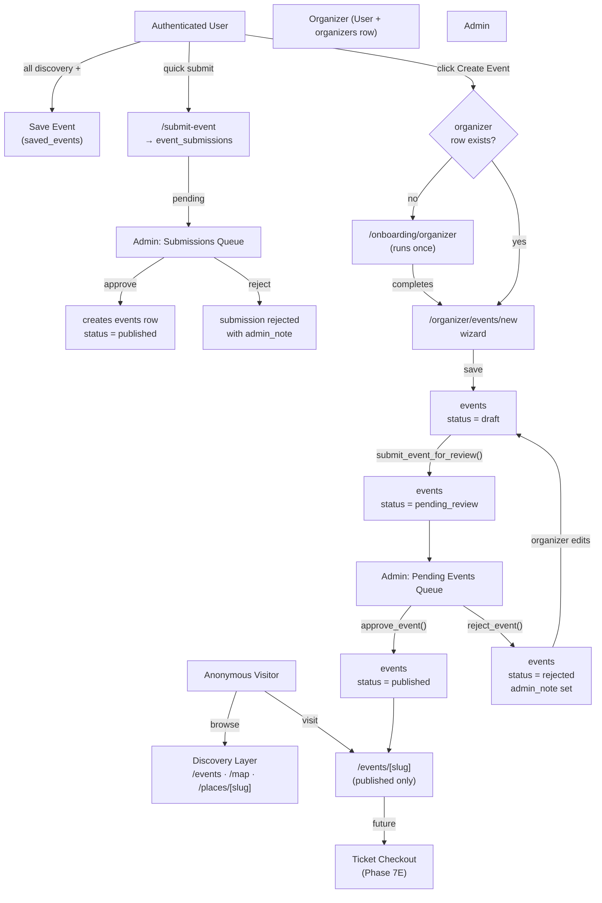

# AlbaGo — Platform Architecture

**Version:** 2.0
**Date:** 2026-05-14
**Status:** Canonical reference — supersedes v1.0 (2026-05-07)
**Applies from:** Phase 7B onwards

This document is the authoritative system reference for AlbaGo. All phase plans, schema migrations, RLS policies, and architectural decisions must be consistent with it. When a decision conflicts with this document, update this document first and record the reason.

---

## 1. What AlbaGo Is

AlbaGo is a **live discovery and event publishing platform** for nightlife, culture, and local experience — initially focused on Albania and the Balkans, designed to scale internationally.

It is three platforms in one, at different stages of maturity:

| Layer | Description | Status |
|---|---|---|
| **Discovery Platform** | Browse events, venues, maps, search, save | Live |
| **Organizer Platform** | Onboarding, event creation, moderation, dashboard | Phase 7 |
| **Commerce Platform** | Checkout, tickets, orders, payouts, analytics | Phase 7E+ |

These three layers must be kept **architecturally separate** as the codebase grows:
- Discovery must stay **fast, public, and SEO-first**
- Organizer must stay **authenticated and workflow-oriented**
- Commerce must become **transactional and highly secure**

Mixing responsibilities between layers is the primary source of long-term technical debt in platforms of this type. Every new feature should be placed in exactly one layer.

---

## 2. The Three Platform Layers

### Layer 1 — Discovery Platform

**Goal:** Any visitor anywhere in the world opens AlbaGo and instantly finds what is happening near them tonight.

**Access:** Public (no account required). Auth adds features (save events), never blocks discovery.

**Surfaces:**
- `/` — Homepage: featured events, trending venues, search, location picker
- `/events` — Events discovery: filterable, searchable, location-aware
- `/events/[slug]` — Event detail: SEO-optimised, server-rendered
- `/places/[slug]` — Venue detail: SEO-optimised, upcoming events list
- `/map` — Interactive map: venue markers, event filters, place panel
- `/dashboard` (saved events section) — Personal bookmarks

**Principles:**
- Every route is fully functional for anonymous users
- Conversion to auth is gentle, contextual, never forced
- Performance is a feature — server rendering, no waterfall fetches
- Public pages generate SEO metadata (`generateMetadata` on every detail route)

### Layer 2 — Organizer Platform

**Goal:** Any user can become an organizer instantly and publish events that reach the discovery layer.

**Access:** Authenticated only. No separate organizer account type — organizer is a **capability extension** of a normal user.

**Surfaces:**
- `/become-organizer` — Public landing page for organizer discovery
- `/onboarding/organizer` — Onboarding survey (runs once, auto-triggered before first event)
- `/organizer` — Organizer dashboard: event list, status counts, actions
- `/organizer/events/new` — Event creation wizard
- `/organizer/events/[id]/edit` — Edit draft or rejected event
- `/organizer/events/[id]/preview` — Preview as-public before submission
- `/organizer/settings` — Organizer profile management
- `/admin` (pending events tab) — Admin moderation of organizer-submitted events

**Principles:**
- "Create Event" is a primary surface — visible at the navbar level for all logged-in users
- Organizer onboarding is a prerequisite step inside the create-event flow, not a separate registration
- State transitions are enforced by Postgres functions (RPC), not client logic
- Organizers can see their own events in any state; public cannot see non-published events

### Layer 3 — Commerce Platform (future)

**Goal:** Organizers sell tickets on-platform; buyers have a seamless purchase and check-in experience.

**Access:** Authenticated for purchase. Organizer account + payment provider verification for selling.

**Surfaces (planned):**
- Ticket section on `/events/[slug]` — ticket tiers, purchase CTA
- `/checkout/[event-slug]` — purchase flow (redirect to provider for MVP)
- `/orders` — buyer order history, QR codes
- `/organizer/orders` — organizer revenue view per event
- `/organizer/payouts` — payout history

**Principles:**
- Commerce never touches Discovery routes directly — ticket CTAs link out from event pages
- All financial state lives in DB functions and payment provider webhooks, never in client state
- RLS on financial tables must be written at a higher security standard than content tables
- Design for provider-agnosticism: `ticket_purchases` is provider-neutral; Stripe is a plugin below it

---

## 3. Actors

An actor is a user or system agent with a defined permission set. AlbaGo has five actors:

### Anonymous Visitor
- Can browse all published content: events, venues, map, detail pages
- Cannot save events, create events, or perform any write operation
- Largest user group — every public page must be fully functional for this actor
- Conversion to auth is encouraged at contextual moments (heart button, "submit event")

### Authenticated User
- Everything anonymous visitors can do, plus:
  - Save events to personal list
  - Submit events via community form (`/submit-event`)
  - View their own submission history and status on `/dashboard`
- Can become an organizer at any time without changing account type
- Identified by: valid Supabase auth session, `profiles.role = 'user'`

### Organizer (a capability, not a role)
- An authenticated user who has a row in the `organizers` table
- Identified by: auth session + `organizers.id = auth.uid()`
- **Not** a separate account type. **Not** `profiles.role = 'organizer'`. This distinction matters.
- Can: create event drafts, manage own events, configure ticket tiers, submit for review
- Cannot: approve their own events, bypass moderation, modify other organizers' events

### Admin
- An authenticated user with `profiles.role = 'admin'`
- Identified by: auth session + `is_admin()` Postgres function returns true
- Can: approve/reject both moderation queues, edit any event or venue, verify organizers, manage users
- `is_admin()` is **load-bearing** — all admin RLS depends on it; see §9

### System (future)
- Automated jobs running with service-role credentials (e.g., set `status = 'completed'` after event date passes)
- Never exposed via public API
- Service-role bypasses RLS — use sparingly and only for defined, auditable operations

---

## 4. System Map

```mermaid
graph TD
  subgraph Discovery["Layer 1: Discovery Platform"]
    Home["/"]
    Events["/events"]
    EventDetail["/events/[slug]"]
    PlaceDetail["/places/[slug]"]
    Map["/map"]
    Dashboard_saved["/dashboard (saved events)"]
  end

  subgraph Organizer["Layer 2: Organizer Platform"]
    BecomeOrg["/become-organizer"]
    Onboarding["/onboarding/organizer"]
    OrgDash["/organizer"]
    Wizard["/organizer/events/new"]
    WizardEdit["/organizer/events/[id]/edit"]
    Admin["/admin"]
  end

  subgraph Commerce["Layer 3: Commerce (future)"]
    Checkout["/checkout/[slug]"]
    Orders["/orders"]
    OrgOrders["/organizer/orders"]
  end

  subgraph DB["Database (Supabase)"]
    EventsTable["events"]
    PlacesTable["places"]
    OrganizersTable["organizers"]
    SubmissionsTable["event_submissions"]
    TicketsTable["event_tickets (Phase 7C)"]
    PurchasesTable["ticket_purchases (Phase 7E)"]
    CitiesTable["cities"]
    ProfilesTable["profiles"]
    SavedEventsTable["saved_events"]
    OnboardingTable["organizer_onboarding_responses"]
  end

  Home --> EventsTable
  Home --> PlacesTable
  Events --> EventsTable
  EventDetail --> EventsTable
  PlaceDetail --> PlacesTable
  Map --> PlacesTable
  Map --> EventsTable

  Wizard --> EventsTable
  Wizard --> PlacesTable
  OrgDash --> EventsTable
  Admin --> EventsTable
  Admin --> SubmissionsTable

  EventDetail --> TicketsTable
  Checkout --> PurchasesTable
  OrgOrders --> PurchasesTable
```



---

## 5. Event Lifecycle — Formal Specification

The event lifecycle is a **first-class architecture concern**. RLS policies, dashboard logic, moderation workflows, and future commerce features all depend on correctly understanding and enforcing these states.

### States

| State | Actor Who Sets It | Publicly Visible | Organizer Can Edit |
|---|---|---|---|
| `draft` | Organizer (on create) | No | Yes |
| `pending_review` | Organizer (on submit) | No | No — locked |
| `published` | Admin (on approve) | Yes | No — contact admin |
| `rejected` | Admin (on reject) | No | Yes — resubmit |
| `cancelled` *(future)* | Organizer or Admin | Yes — with label | Organizer (limited) |
| `completed` *(future)* | System (scheduled job, after date passes) | Yes — archived | No |

### Transitions

```
[DRAFT] ──submit_event_for_review()──► [PENDING_REVIEW]
                                               │
                          ┌────────────────────┤
                          ▼                    ▼
                     [PUBLISHED]          [REJECTED]
                          │                    │
                          │              organizer edits
                          │                    │
                     [CANCELLED]◄──────────────┘
                     (future)       resubmit → [PENDING_REVIEW]
                          │
                     [COMPLETED]
                     (future, system)
```

### Invariants (non-negotiable)

1. Only the organizer who owns an event (or an admin) can edit it while in `draft` or `rejected`.
2. No organizer can edit an event in `pending_review` or `published` — it is locked.
3. `draft` and `pending_review` are NEVER publicly visible. Not on the homepage, not on `/events`, not on the map, not on `/events/[slug]` for non-owners.
4. `rejected` is NEVER publicly visible. The organizer sees it in their dashboard with the admin note.
5. State transitions happen exclusively inside Postgres RPC functions. Client code never directly updates `events.status`.
6. `published_at` is set by `approve_event()` and is immutable thereafter.
7. An event's slug is set on first save and never regenerated (even if title changes), because the slug is a permanent public URL.

### Visibility Matrix

| Status | Anon | Auth non-owner | Organizer (owner) | Admin |
|---|---|---|---|---|
| `draft` | ✗ | ✗ | Read + Write | Read + Write |
| `pending_review` | ✗ | ✗ | Read only | Read + Write |
| `published` | ✓ | ✓ | Read only | Read + Write |
| `rejected` | ✗ | ✗ | Read + Write | Read + Write |
| `cancelled` *(future)* | ✓ with label | ✓ with label | Read + limited write | Read + Write |
| `completed` *(future)* | ✓ archived | ✓ archived | Read only | Read + Write |

### Status as TEXT (not ENUM)

Postgres ENUM types require `ALTER TYPE ... ADD VALUE` which cannot run inside a transaction and may block on large tables. `events.status` uses `TEXT` with a `CHECK` constraint:

```sql
CONSTRAINT events_status_check CHECK (
  status IN ('draft', 'pending_review', 'published', 'rejected', 'cancelled', 'completed')
)
```

Adding new values requires only updating this constraint. This is the pattern for all status-like columns in the codebase.

---

## 6. Event Origin Taxonomy

AlbaGo has multiple event ingestion paths. Every event should be traceable to its origin for moderation filtering, analytics, and fraud detection. The `event_origin` vocabulary is defined here even though it is not yet a DB column — it will be added in Phase 7B.

| Origin | Table | Description |
|---|---|---|
| `organizer_dashboard` | `events` | Created by an organizer via the wizard. Has `organizer_id` set. |
| `community_submission` | `event_submissions` | Submitted via `/submit-event` by any authenticated user. Low-friction. |
| `admin_seeded` | `events` | Directly inserted by admins. `organizer_id` null. The current event catalogue. |
| `imported` | `events` | Ingested from an external data source (future). `organizer_id` null. |

### Community submissions are a permanent strategic asset

Community submissions (`event_submissions`) are **NOT** a legacy system or a stepping stone to the organizer flow. They are a **complementary low-friction ingestion channel** that serves a different audience:

- An Albanian resident who knows about a local festival but is not an event organizer
- A tourist who spotted a poster for something happening tonight
- A venue regular who wants to flag an event to the community

These contributors should never be forced through organizer onboarding. The friction is the point: less commitment → lower quality floor → moderation handles it. More commitment → higher quality floor → organizer track.

**The two tracks are forever parallel.** Never merge them into one table or one flow.

---

## 7. Ownership Model

### Terminology

| Term | Definition |
|---|---|
| **Creator user** | The authenticated user (auth.uid()) who initiated an event or submission |
| **Organizer entity** | The row in the `organizers` table linked to that user |
| **Event ownership** | The binding between an event and its organizer (`events.organizer_id = organizers.id`) |
| **Moderation state** | The current lifecycle status of an event as it moves through review |
| **Public visibility state** | Whether an event is visible to anonymous users (only `published`, `cancelled`, `completed`) |

### Event ownership rules

- `events.organizer_id` is **nullable**. Community submissions and admin-seeded events have no organizer.
- Ownership is established at event creation and is **immutable** — events cannot be re-assigned between organizers.
- Ownership check in RLS: `auth.uid() = organizers.id` where `organizers.id` is the FK value in `events.organizer_id`. Since `organizers.id = auth.users.id` (1:1 model), this simplifies to `auth.uid() = events.organizer_id`.
- An admin can edit any event regardless of ownership.

### Organizer model — 1:1 today, many-to-many tomorrow

Current: `organizers.id = auth.users.id`. One user → one organizer identity.

When teams are needed (planned Phase 7D): add `organizer_members(organizer_id, user_id, role, created_at)`. RLS checks will migrate from `auth.uid() = organizer_id` to `EXISTS (SELECT 1 FROM organizer_members WHERE user_id = auth.uid() AND organizer_id = ...)`. This migration is wide but mechanical — every event/ticket RLS policy updates in one batch. The `organizers` table schema does not change.

### Venue ownership — future concept

Currently, `places` are passive records owned by no one. Future:

```
organizer ──► organizer_venue_claims ◄──► places
```

A `organizer_venue_claims` join table (pending/verified/rejected states) allows an organizer to claim stewardship of a venue. Verified venue owners can update venue details and create recurring event templates. They cannot approve their own events — moderation still applies.

**Schema impact today:** The `places` table needs no changes. The `organizers` table needs no changes. Only a join table is added. No current decision closes this door.

---

## 8. Moderation Model and Philosophy

### Philosophy

AlbaGo is a **curated platform with lightweight friction**.

- It is NOT self-publishing (anything posted goes live automatically)
- It is NOT fully closed (only the team can post)
- It IS moderated: human review is the quality gate

This philosophy is intentional. It protects the discovery experience (no spam events polluting the map), builds organizer trust (published events carry an implicit quality signal), and enables the platform to scale internationally without becoming a repository of garbage.

### Moderation tracks

```
Community Track                          Organizer Track
─────────────                            ───────────────
/submit-event                            /organizer/events/new
     │                                         │
     ▼                                         ▼
event_submissions                          events (draft)
(status: pending)                               │
     │                                  submit_event_for_review()
     ▼                                         │
  /admin                                        ▼
(Submissions tab)                          events (pending_review)
     │                                         │
  admin reviews                             /admin
     │                                  (Pending Events tab)
     ├── approve ──► creates events row       │
     │               (status: published)   admin reviews
     │                                         │
     └── reject ──► submission rejected         ├── approve_event()
                                               │    events → published
                                               │
                                               └── reject_event()
                                                    events → rejected
                                                    → organizer edits
                                                    → resubmit
```

The two tracks are **distinct operations**:
- Approving a community submission **creates** a new `events` row
- Approving an organizer event **flips the status** of an existing `events` row

The admin UI must make this distinction visually clear — two separate tabs, two separate action handlers, never shared code between them.

### Moderation states for community submissions

| State | Meaning |
|---|---|
| `pending` | Awaiting admin review |
| `approved` | Admin approved; corresponding `events` row created |
| `rejected` | Admin rejected with note; submitter notified |
| `more_info_needed` *(future)* | Admin requests clarification; submission pauses, submitter edits |

### What gets auto-approved (future trust scoring)

No auto-approval in MVP. Every event goes through human review. Future trust score gates:

- Verified organizer + previously approved events → eligible for auto-approval
- Score components: approval rate, account age, verified badge, event quality signals
- Admins tune the threshold; default is "never auto-approve"

### Anti-spam and anti-fraud roadmap

Document now; implement as adoption grows:

**Tier 1 — Before Phase 7E (before ticket sales):**
- Rate limit event creation: max N drafts per organizer per rolling 24h window (server-side, Supabase Edge Function)
- Duplicate event detection: same `organizer_id` + same `date` + fuzzy title match → flag for admin
- Email verification enforced before organizer onboarding (Supabase can require this at auth level)
- Account age heuristic: accounts < 7 days old receive higher scrutiny flag in admin UI

**Tier 2 — At scale:**
- Organizer trust score (stored in `organizers` table, updated by DB trigger on approval/rejection)
- Public event reporting: "Report this event" CTA → creates `event_reports` row → after N reports, auto-surfaces to moderation queue
- Duplicate venue prevention: fuzzy match + `google_place_id` UNIQUE constraint

**Tier 3 — Commerce phase:**
- Phone verification for organizers who enable ticket sales
- Velocity checks on ticket purchases (multiple purchases from same IP/card in short window)
- Fraud detection webhook from payment provider
- Chargeback monitoring

---

## 9. Security Boundaries

This is a **hard architectural rule** that applies to all code written for AlbaGo:

```
RLS            = final security boundary    (DB layer, cannot be bypassed by app)
RPC functions  = transactional workflows    (enforce invariants, atomic multi-table ops)
Server guards  = UX routing gates           (redirect unauthorized users, not a security layer)
Frontend       = UX validation only         (never trusted for security decisions)
```

### Implications

**RLS is not optional.** If a Supabase RLS policy is wrong, a correctly-formed client API call WILL expose or corrupt data. Server-side code and React components cannot compensate for a missing or incorrect policy. RLS must be written and verified first; application code builds on top of it.

**Server component guards are UX, not security.** A `redirect('/sign-in')` in a server component prevents unauthorized users from seeing the page. It does NOT prevent them from calling the Supabase API directly (e.g., via Postman, curl, or a tampered client). The RLS policy is what actually blocks the operation.

**Frontend validation is for user experience only.** A disabled "Next" button on a wizard step prevents accidental bad submissions. It does not prevent a user from submitting malformed data via the network. The `submit_event_for_review()` RPC function validates required fields server-side before any state transition.

**Never trust `organizer_id` passed from the client.** Any RPC function that takes an `organizer_id` parameter must validate it against `auth.uid()`. Use `SECURITY INVOKER` functions (already established) so RLS still applies. Never use `SECURITY DEFINER` for organizer-facing functions.

### `is_admin()` — load-bearing function

Every admin RLS policy across all tables uses `public.is_admin()`. This function:
- Reads `profiles.role = 'admin'` for the current `auth.uid()`
- Must never be renamed, dropped, or have its semantics changed without a full policy audit
- Must be verified before each Phase that adds new admin-dependent policies:

```sql
SELECT prosrc FROM pg_proc WHERE proname = 'is_admin';
-- Expected output: SELECT (role = 'admin') FROM profiles WHERE id = auth.uid()
```

---

## 10. RLS Philosophy

Each table follows a consistent policy structure:

```
SELECT  — minimum visibility needed (public where safe, owner + admin otherwise)
INSERT  — caller proves ownership at write time via WITH CHECK (auth.uid() = owner_field)
UPDATE  — state-conditional: owner can edit in mutable states; admin can always edit
DELETE  — admin only; prefer soft-delete (status = 'deleted') over hard delete
```

### Soft deletes are preferred

Hard deletes destroy audit trails and make recovery impossible. Status transitions to `'deleted'` or `'cancelled'` preserve history. Reserve hard deletes for test data cleanup and GDPR deletion requests (which require a documented process regardless).

### Policy naming convention

```
{table}_{operation}_{actor}

organizers_select_public
organizers_insert_self
organizers_update_self_or_admin
organizers_delete_admin

events_select_public_or_owner_or_admin
events_insert_organizer
events_update_owner_draft_or_admin
events_delete_admin
```

Consistent naming makes policy audits tractable. Every new policy must follow this pattern.

### Verification requirement

Every migration that adds new RLS policies must include verification queries in the migration document. Minimum tests per table:

1. Anonymous user: expected operation fails (42501) or returns empty set
2. Authenticated non-owner: cannot read private rows or write others' rows
3. Owner: can read own rows, write in permitted states
4. Admin: can read and write anything

Use `SET LOCAL ROLE anon` and explicit role testing (not browser-level testing) for DB-layer verification.

---

## 11. Permission Map

Full permission matrix for the current production tables:

| Table | Anon SELECT | Auth SELECT | Owner SELECT | Admin SELECT | INSERT | Owner UPDATE | Admin UPDATE | DELETE |
|---|---|---|---|---|---|---|---|---|
| `events` | published only | published only | any status | any | organizer only | draft/rejected only | any | admin only |
| `places` | active/null | active/null | — | any | admin only | — | any | admin only |
| `profiles` | — | own only | own | any | system trigger | own (non-role) | any | admin only |
| `organizers` | any | any | own | any | self (=auth.uid()) | own | any | admin only |
| `organizer_onboarding_responses` | — | own | own | any | self | self | any | admin only |
| `event_submissions` | — | own | own | any | self | own+pending | any | admin only |
| `saved_events` | — | own | own | any | self | — | — | self |
| `cities` | any | any | — | any | admin only | — | admin only | admin only |
| `event_tickets` *(Phase 7C)* | published event's | published event's | any status | any | owner+draft | owner+draft/rejected | any | admin only |
| `ticket_purchases` *(Phase 7E)* | — | own | own | any | self (via checkout fn) | — | admin only | admin only |

---

## 12. Event Flow Map



---

## 13. Moderation Flow Map

```mermaid
flowchart LR
  subgraph Community["Community Track"]
    CSubmit["User submits\n/submit-event"] --> CSub["event_submissions\nstatus: pending"]
    CSub --> CAdmin["/admin\nSubmissions tab"]
    CAdmin -->|approve| CCreate["creates events row\nstatus: published"]
    CAdmin -->|reject| CReject["submission rejected\nadmin_note added"]
    CAdmin -.->|more info needed\n(future)| CInfo["submission paused\nuser notified"]
    CInfo -.->|user updates| CSub
  end

  subgraph Organizer_Track["Organizer Track"]
    OCreate["Organizer creates\ndraft event"] --> ODraft["events\nstatus: draft"]
    ODraft -->|submit_event_for_review| OPending["events\nstatus: pending_review\norganizer LOCKED"]
    OPending --> OAdmin["/admin\nPending Events tab"]
    OAdmin -->|approve_event| OPublished["events\nstatus: published"]
    OAdmin -->|reject_event| ORejected["events\nstatus: rejected\nadmin_note added"]
    ORejected -->|organizer edits| ODraft
  end

  CCreate --> Public["Public\n/events/[slug]"]
  OPublished --> Public
```

---

## 14. "Create Event" as a Primary Surface

### Current state (Phase 7A)

Discovery path: `/become-organizer` landing page → `/onboarding/organizer` → `/organizer` dashboard. The flow is somewhat hidden and frames becoming an organizer as a separate identity decision.

### Target state (Phase 7B)

"Create Event" is a **navbar-level CTA for all authenticated users**. The framing is: the user is creating an event, not registering as a new type of account.

**UX flow:**
1. Logged-in user clicks "Create Event" in the navbar
2. Routed to `/organizer/events/new`
3. Server guard on `/organizer/events/new` checks for organizer row:
   - If none → `redirect('/onboarding/organizer?next=/organizer/events/new')`
   - If exists → render wizard
4. Onboarding completion reads `?next=` param → redirects to wizard, not the dashboard
5. User is immediately in the creation flow; the "organizer profile" step felt like a setup screen, not a registration wall

**Implementation in Phase 7B:**
- Add "Create Event" to `LandingNavbar.tsx` (auth-gated, invisible when signed out)
- Add `?next=` param handling to the onboarding completion redirect in `OnboardingClient.tsx`
- Server guard on `/organizer/events/new` redirects to onboarding with `?next=` if no organizer row

**Psychological principle:** Users who want to run events think of themselves as event creators, not as "organizers joining a platform". The UX must reflect this. The platform gains a capability; the user gains an identity label only as a side effect.

---

## 15. Future Expansion Model

### Teams and multi-user organizers

When teams are needed, add `organizer_members`:

```sql
CREATE TABLE public.organizer_members (
  organizer_id  uuid REFERENCES public.organizers(id) ON DELETE CASCADE,
  user_id       uuid REFERENCES auth.users(id) ON DELETE CASCADE,
  role          text CHECK (role IN ('owner', 'editor', 'viewer')),
  created_at    timestamptz DEFAULT now(),
  PRIMARY KEY (organizer_id, user_id)
);
```

RLS migration: all `auth.uid() = events.organizer_id` checks become:
```sql
EXISTS (
  SELECT 1 FROM organizer_members
  WHERE organizer_id = events.organizer_id
    AND user_id = auth.uid()
    AND role IN ('owner', 'editor')
)
```

This is a wide but mechanical migration. Every RLS policy on `events` and `event_tickets` updates in one batch. No schema changes to `events`, `organizers`, or `event_tickets`.

### International expansion

The platform is designed for international scale from the start:
- `location_slug` + `city` + `country` fields on events support multi-city filtering today
- `cities` table is the authoritative city registry (not hardcoded)
- `currency` on `event_tickets` is per-ticket (not hardcoded EUR)
- Full-text search uses `'simple'` tsvector config (language-agnostic, safe for Albanian + English + others)
- No i18n infrastructure yet — add via `next-intl` or equivalent when a second language is required

### Payment provider architecture

`ticket_purchases` is designed to be provider-agnostic:

```sql
ticket_purchases (
  id                uuid PK,
  ticket_id         uuid FK event_tickets(id),
  buyer_id          uuid FK auth.users(id),
  quantity          int,
  amount_cents      int,           -- in the purchase currency
  currency          text,          -- 'EUR', 'ALL', etc.
  status            text,          -- 'pending', 'completed', 'refunded', 'failed'
  provider          text,          -- 'stripe', 'paypal', 'wise' — provider-agnostic
  provider_ref      text,          -- payment intent ID or equivalent
  created_at        timestamptz,
  completed_at      timestamptz
)
```

Stripe Connect (or any other provider) is a plugin below this table. Switching providers does not require schema changes.

**Albania note:** Confirm payment provider availability for Albanian businesses before committing to Stripe Connect. As of 2026, Stripe's payout availability for Albanian business bank accounts is limited. Consider PayPal Payouts or Wise API as alternatives. Research this in Phase 7D before Phase 7E implementation begins.

### Ticket quantity safety

`event_tickets` does NOT have a `quantity_sold` column. Remaining capacity is always computed:

```sql
CREATE OR REPLACE FUNCTION public.remaining_tickets(p_ticket_id uuid)
RETURNS int
LANGUAGE sql
STABLE
AS $$
  SELECT COALESCE(t.quantity_total, 2147483647)
       - COUNT(p.id)::int
  FROM event_tickets t
  LEFT JOIN ticket_purchases p
    ON p.ticket_id = t.id AND p.status = 'completed'
  WHERE t.id = p_ticket_id
  GROUP BY t.quantity_total
$$;
```

Purchases use `SELECT ... FOR UPDATE` on the ticket row inside the checkout RPC function to prevent oversell. This is the correct pattern. Never increment a counter column under concurrent load.

---

## 16. Roadmap Relationships

Phase dependencies: a phase is only safe to start after all its predecessors are complete and deployed.

```
7A (organizers + onboarding + dashboard) ─── COMPLETE
 │
 └─► 7B (event creation wizard + draft system + events schema extension)
      │
      └─► 7C (ticket model + admin moderation extension + public page enrichment)
           │
           ├─► 7D (organizer profile pages + saved_places + audit polish + sitemap)
           │
           └─► 7E (payments MVP) ─── plan separately, research provider first
                │
                └─► 8+ (teams, analytics, real-time, mobile native)
```

**Phase 7B is the load-bearing moment.** It extends the `events` table schema in ways that touch every public query. Get it wrong and either organizer drafts appear publicly (data leak) or published events break. This is why the Phase 7B plan must be written and reviewed before any code is touched.

**7C and 7D are independent after 7B.** Once the event creation and draft system is live, ticket model (7C) and discoverability polish (7D) can proceed in parallel or in either order. Recommended order: 7C first (closes the publish loop for organizers), then 7D (polish and growth).

**7E is gated on real-world signal.** Do not start the payments phase until:
1. At least 5 organizers have published events through the 7B–7C flow
2. Payment provider availability for Albanian businesses is confirmed
3. Legal entity, terms of service, and privacy policy are in place

---

## 17. Glossary

Terms used consistently throughout AlbaGo documentation and code:

| Term | Definition |
|---|---|
| **Actor** | A user or system agent with a defined permission set (Anonymous Visitor, Authenticated User, Organizer, Admin, System) |
| **Capability** | A feature set unlocked for a user without changing their account type (e.g., organizer capability = having an `organizers` row) |
| **Community submission** | An event submitted via `/submit-event` by any authenticated user, stored in `event_submissions`. A permanent, strategic, low-friction ingestion channel |
| **Creator user** | The `auth.uid()` of the user who initiated an event or submission |
| **Draft** | An event in `status = 'draft'` — created by an organizer, not yet submitted for review, invisible publicly |
| **Event lifecycle** | The formal sequence of states an event can occupy from creation through archival |
| **Event origin** | The mechanism by which an event entered the system: `community_submission`, `organizer_dashboard`, `admin_seeded`, `imported` |
| **Event ownership** | The binding between an event and the organizer who created it (`events.organizer_id = organizers.id`) |
| **Moderation state** | The current lifecycle status of an event or submission as it moves through the review workflow |
| **Organizer** | An authenticated user who has completed onboarding and has a row in the `organizers` table. Not a separate account type |
| **Organizer entity** | The `organizers` table row representing a user's organizing identity (display name, slug, contact info) |
| **Public visibility state** | Whether an event is visible to anonymous users. Only `published`, `cancelled`, and `completed` events are publicly visible |
| **RLS** | Row Level Security — Postgres-enforced access control at the database row level. The final security boundary; cannot be bypassed by application code |
| **RPC** | A Postgres function called via Supabase `.rpc()`. Used for transactional workflows, state transitions, and operations requiring server-side invariant enforcement |
| **Server guard** | A Next.js server component that checks auth state and redirects unauthorized users. A UX gate, not a security boundary |
| **Trust score** | A future computed value per organizer reflecting their history of quality submissions (approval rate, account age, verified status) |
| **Venue claim** | A future relationship allowing an organizer to claim stewardship of a `places` record |
| **Verified organizer** | An organizer who has been manually verified by an admin, indicated by `organizers.verified = true`. Grants a visible badge and future auto-approval eligibility |

---

*This document is updated at the start of each phase. Changes that affect lifecycle states, RLS philosophy, or security boundaries require a corresponding update here before any code is written.*
